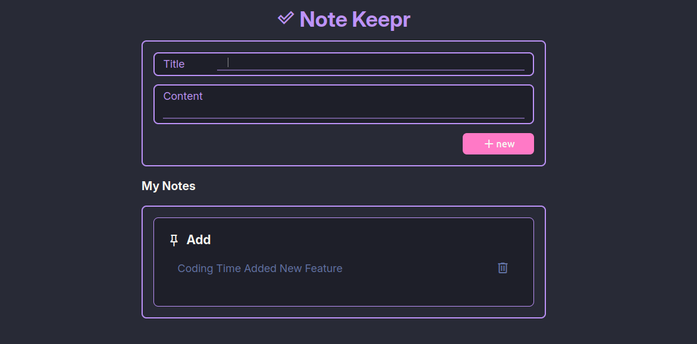

# 📝 Mark Down Note Taking App

[](https://github.com/rjsudhin/mark-down-note-taking-app/stargazers)
[](https://github.com/rjsudhin/mark-down-note-taking-app/fork)
[](https://github.com/rjsudhin/mark-down-note-taking-app/issues)
[](LICENSE)

A clean, minimalist note-taking app built using **HTML, CSS, and JavaScript**, with full **localStorage** support. Your notes are saved directly in your browser — no backend required.

---

### 🔮 Live Demo

👉 **Try it out here:**  
[https://rjsudhin.github.io/mark-down-note-taking-app/](https://rjsudhin.github.io/mark-down-note-taking-app/)

---

### 🎯 Features

- 💾 Save notes using `localStorage`
- ⚡ Real-time UI updates
- 🌙 Dark theme with purple-pink styling
- ♻️ Auto-refresh after saving
- 🗑️ Delete note functionality
- 📦 Fully client-side

---

### 📸 Preview




---

### 📁 Project Structure

```bash
mark-down-note-taking-app/
│
├── index.html        # Main HTML structure
├── styles.css        # Dark-themed styles
├── app.js            # JavaScript logic
└── README.md         # This file

```

### 🛠️ Technologies Used

- **🧩 HTML5**
- **🎨 CSS3**
- **⚙️ JavaScript (Vanilla)**
- **🌐 GitHub Pages (for deployment)**
